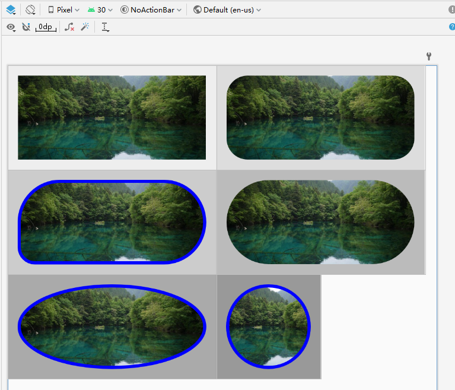

# 轻量又快速的RoundImageView

完全基于ImageView，虽然单次draw不是最快的，但是它不会无缘无故的重新执行draw，所以综合来说它很依然很快

```
        <com.wang.round.RoundedImageView
            android:id="@+id/riv"
            android:layout_width="400dp"
            android:layout_height="200dp"
            android:layout_marginTop="1px"
            android:background="#aaa"
            android:padding="20dp"
            android:scaleType="centerCrop"
            android:src="@drawable/ttt3"
            app:borderColor="#f0f"
            app:borderWidth="10dp"
            app:cornerRadius="50dp" />
```



#### 全部属性：

cornerRadius、cornerTopLeftRadius、cornerTopRightRadius、cornerBottomLeftRadius、cornerBottomRightRadius、oval

borderWidth、borderColor

### 支持情况

- 支持圆角、四边不同圆角、椭圆和边框

- 支持xml预览

- 所有ImageView所支持的图像均支持，如：glide加载gif图

- 所有ImageView的属性均可用，并且完全一致（setCropToPadding除外），如adjustViewBounds、scaleType、padding

### Gradle导入

你的build.gradle必须有jitpack.io，像这样：

```
allprojects {
    repositories {
        maven { url 'https://jitpack.io' }
        google()
        jcenter()
    }
}
```

然后：
`api或implementation 'com.github.weimingjue:RoundedImageView:0.9.2'`

